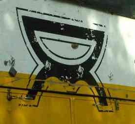
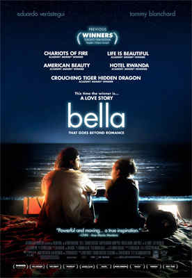
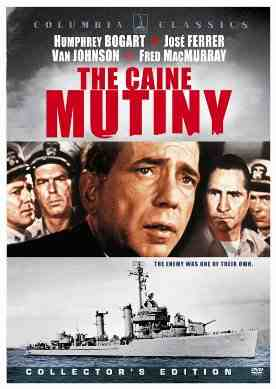
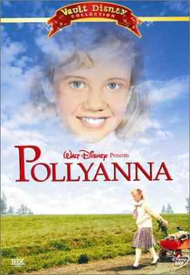
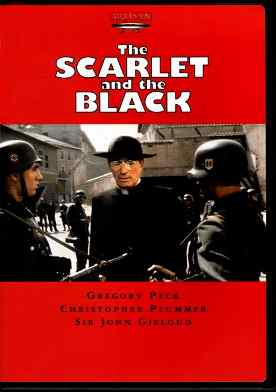

# Favorites

## This is a list of some of our favorite things

> [John G. Lake Ministries](http://jglm.org) brings a complete Biblical message of the New Covenant way of life, as originally intended by our Lord, to His people. While the benefits of Jesus’ life, death and resurrection are available to all, John G. Lake Ministries are specifically looking for those who are not satisfied with the “status quo”. We unashamedly bring a revolutionary message to the Body of Christ and the world.

{: width="276" height="253"}

> [Overland Missions](http://overlandmissions.com) is a family we are proud to be a part of.

{: width="276" height="400"}

> Bella is a love story that goes beyond romance.

{: width="276" height="389"}

> The Caine Mutiny is a challenging lesson on judging.

{: width="276" height="400"}

> Pollyanna is encouragement to live childlike faith and be glad.

{: width="276" height="392"}

> The Scarlet and the Black inspires us to be courageous and loving.